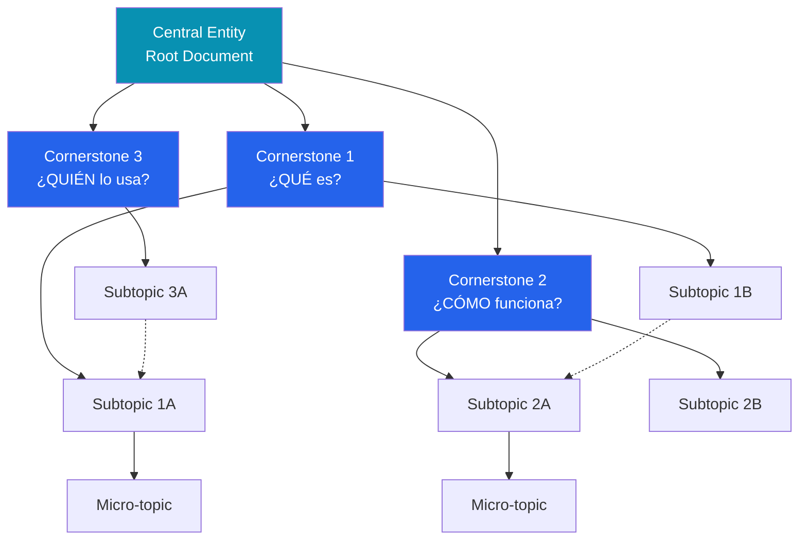

# Topical Map — Plantilla Práctica

Plantilla para crear mapas topicales siguiendo la metodología de Holistic SEO.

---

## Paso 1: Definir Source Context

Antes de mapear, define el contexto del sitio:

```markdown
### Source Context
- **Sitio:** [URL]
- **Propósito:** [Qué hace el sitio]
- **Monetización:** [Cómo genera ingresos]
- **Audiencia primaria:** [Quién lo usa]
- **Audiencia secundaria:** [Quién más]
- **Vertical/Industria:** [Sector]
- **Diferenciador:** [Qué lo hace único]
```

## Paso 2: Identificar Central Entity

La entidad que aparece en TODAS las sub-secciones del mapa.

```markdown
### Central Entity
- **Nombre:** [Entidad principal]
- **Tipo:** [Producto, servicio, concepto, persona, organización]
- **Atributos principales:** [Lista de atributos clave]
- **Relaciones clave:** [Con qué otras entidades se conecta]
```

## Paso 3: Definir Central Search Intent

La intención unificada que recorre todo el mapa.

```markdown
### Central Search Intent
- **Intent:** [Intención principal del usuario]
- **Variaciones:** [Diferentes formas de expresar la misma intención]
- **Audiencia:** [Quién busca esto]
```

## Paso 4: Mapear Cornerstone Content

Responde las preguntas fundamentales sobre la entidad central:

| Pregunta | Cornerstone | Target Query | URL Slug |
|----------|------------|--------------|----------|
| **¿QUÉ es?** | Definición comprehensiva | [query principal] | /[slug]/ |
| **¿CÓMO funciona?** | Proceso/mecanismo | [query cómo] | /como-[slug]/ |
| **¿QUIÉN lo usa/hace?** | Actores involucrados | [query quién] | /[actor]-[slug]/ |
| **¿DÓNDE se aplica?** | Contexto/ámbito | [query dónde] | /[contexto]-[slug]/ |
| **¿POR QUÉ importa?** | Beneficios/razones | [query por qué] | /por-que-[slug]/ |
| **¿CUÁNTO cuesta?** | Precio/inversión | [query precio] | /precio-[slug]/ |

## Paso 5: Mapear Subtopics

Para cada cornerstone, identificar subtopics:

```markdown
### Subtopic Hierarchy

Cornerstone: [QUÉ es X]
├── Subtopic 1: [Definición detallada]
│   ├── Micro-topic 1a: [Aspecto específico]
│   └── Micro-topic 1b: [Otro aspecto]
├── Subtopic 2: [Tipos/Variantes]
│   ├── Micro-topic 2a: [Tipo A]
│   └── Micro-topic 2b: [Tipo B]
└── Subtopic 3: [Historia/Evolución]
    └── Micro-topic 3a: [Hito específico]
```

## Paso 6: Clasificar Documentos

| Tipo | Función | Características |
|------|---------|----------------|
| **Root Document** | Hub central que enlaza componentes significativos | Alta autoridad, muchos internal links, cornerstone content |
| **Node Document (Quality)** | Nodo que busca posicionar para queries específicas | Contenido profundo, optimizado para ranking |
| **Node Document (Coverage)** | Nodo que amplía cobertura topical | Contenido enfocado, completa gaps en el mapa |

## Paso 7: Tabla del Topical Map

| # | Topic | Type | Parent | Target Query | Intent | Priority | URL Slug | Schema | Status |
|---|-------|------|--------|--------------|--------|----------|----------|--------|--------|
| 1 | [Tema] | Root/Quality/Coverage | - | [query] | Info/Nav/Trans/Comm | P1/P2/P3 | /slug/ | Article/FAQ/HowTo | Draft/Published |

**Columnas:**
- **#:** Número de identificación
- **Topic:** Nombre descriptivo del tema
- **Type:** Root Document / Node Quality / Node Coverage
- **Parent:** Número del documento padre (- si es root)
- **Target Query:** Query principal a posicionar
- **Intent:** Tipo de intención de búsqueda
- **Priority:** P1 (urgente), P2 (importante), P3 (deseable)
- **URL Slug:** URL propuesta
- **Schema:** Tipo de schema markup (Rank Math + Spectra)
- **Status:** Estado actual

## Paso 8: Diagrama Mermaid



**Leyenda:**
- Líneas sólidas (→) = Relación jerárquica padre-hijo
- Líneas punteadas (-.→) = Relaciones semánticas cruzadas (cross-links)
- Azul oscuro = Root Documents
- Azul medio = Cornerstones
- Default = Subtopics y micro-topics

## Paso 9: Internal Linking Architecture

Para cada documento, definir:

```markdown
### Internal Links — [Nombre del Documento]
- **Links FROM this page:**
  - [Anchor text 1] → /url-destino-1/ (relación: padre)
  - [Anchor text 2] → /url-destino-2/ (relación: sibling)
  - [Anchor text 3] → /url-destino-3/ (relación: hijo)
- **Links TO this page (expected):**
  - Desde /url-origen-1/ con anchor "[texto]"
  - Desde /url-origen-2/ con anchor "[texto]"
```

**Reglas de linking:**
- Links contextuales (dentro de párrafos) > links de navegación
- Anchor text refleja el foco topical del destino
- El patrón de links debe reflejar el topical graph
- Máximo 3-5 links contextuales por 1000 palabras
- Cada link debe tener relevancia topical genuina

## Paso 10: Content Brief Template (por nodo)

```markdown
### Content Brief: [Título]

**Datos básicos:**
- Nodo #: [número en el topical map]
- Tipo: Root / Quality Node / Coverage Node
- Parent: [nodo padre]
- URL: /[slug]/
- Word count: [rango orientativo]

**Queries target:**
- Primary: [query principal]
- Secondary: [query 2], [query 3]
- Long-tail: [query específica 1], [query específica 2]

**Search intent:** [Informational / Navigational / Transactional / Commercial]

**Heading structure:**
- H1: [título — coincide con primary query]
- H2: [subtema 1 — coincide con secondary query]
  - H3: [detalle]
  - H3: [detalle]
- H2: [subtema 2]
- H2: FAQ (con Spectra FAQ Schema block)

**Entidades a mencionar:**
| Entidad | Tipo | Atributos a incluir |
|---------|------|-------------------|
| [Entidad 1] | [Tipo] | [Atributos relevantes] |

**Internal links a incluir:**
- [Anchor text] → /url/ (razón)
- [Anchor text] → /url/ (razón)

**Schema markup:**
- Page-level (Rank Math): [tipo]
- Block-level (Spectra): [FAQ / HowTo / Review / ninguno]

**Information Gain angle:**
[Qué aporta este contenido que NO existe en los top 10 resultados actuales]

**GEO notes:**
[Cómo optimizar para extracción por IA — definiciones, EAV, respuesta directa]

**Initial Contact Section:**
[Qué debe comunicar la primera sección del artículo]
```
